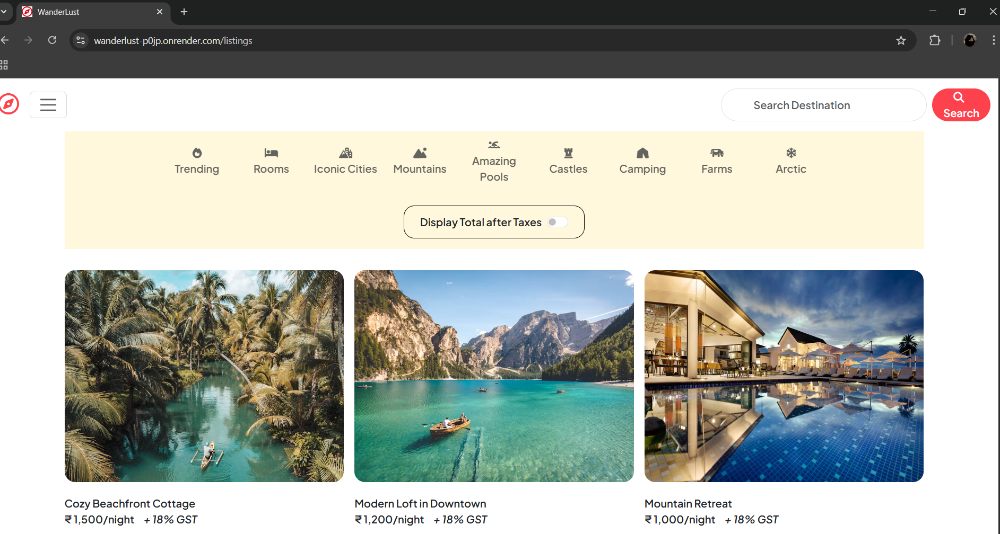
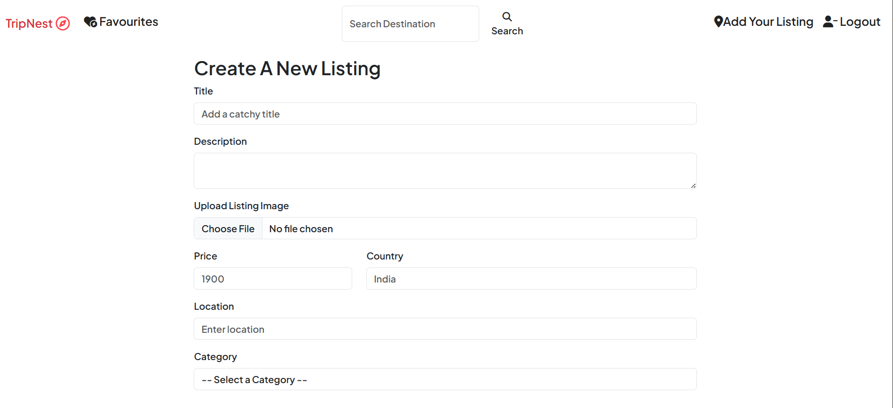

🏡 TripNest

A full-stack travel & stay listing application where users can create, view, edit, and delete listings — complete with image uploads, reviews, and category-based filters.

🌍 Live Project: https://wanderlust-p0jp.onrender.com

📸 Screenshots
🔹 Home Page

🔹 Create Listing Form

🔹 View Listing

🚀 Features

🔐 User Authentication (Login/SignUp)

🏡 Create, Read, Update, Delete (CRUD) for Listings

🖼️ Upload listing images (Cloudinary)

💬 Post and delete reviews

🔎 Search & Category-based filters

📱 Fully responsive design for mobile & desktop

🌐 EJS templating with Bootstrap styling

⚠️ Input validation and error handling

🛠️ Tech Stack
Category	Technology
Frontend	HTML, CSS, Bootstrap, EJS
Backend	Node.js, Express.js
Database	MongoDB, Mongoose
Authentication	Passport.js (Local Strategy)
File Uploads	Multer + Cloudinary
Validation	Joi, Express Error Middleware
Deployment	Render / Vercel / Netlify
📂 Folder Structure
TripNest/
├── models/
├── routes/
├── public/
├── views/
├── middleware/
├── utils/
├── app.js
└── README.md

🧪 Setup Instructions

Clone the repo:

git clone https://github.com/rishima17/TripNest.git
cd TripNest

Install dependencies:

npm install

Set up environment variables:
Create a .env file:

DB_URL=your_mongodb_url
CLOUDINARY_CLOUD_NAME=your_cloud_name
CLOUDINARY_KEY=your_api_key
CLOUDINARY_SECRET=your_api_secret
SESSION_SECRET=your_random_secret

Run the app:

npm start

📄 License

This project is licensed under the MIT License.
